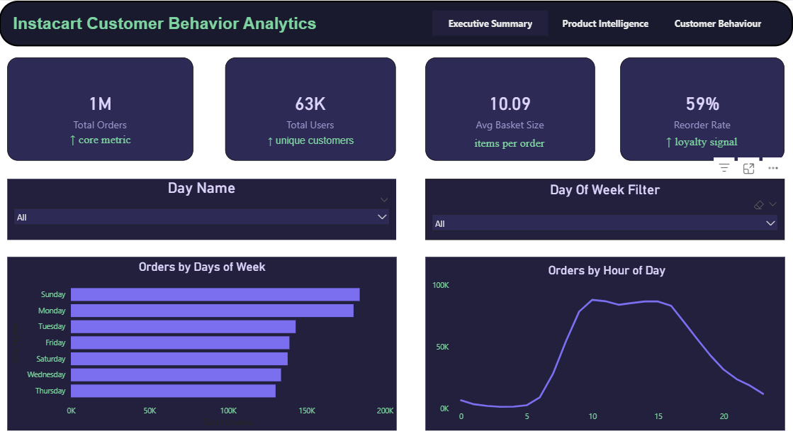
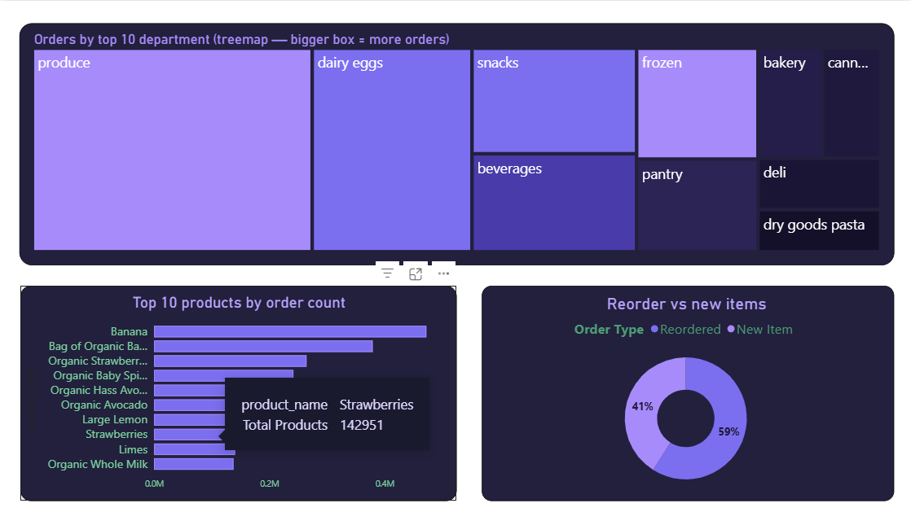
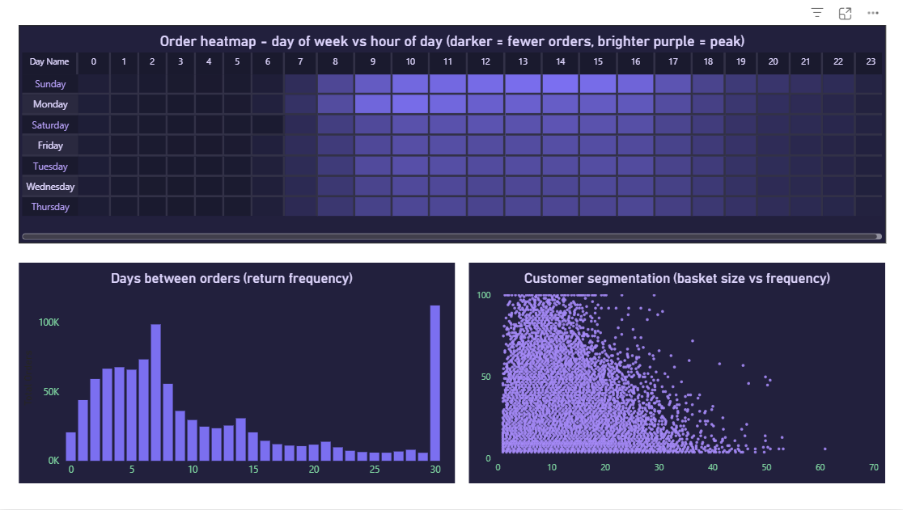

# Instacart Customer Behavior Analysis — SQL + Power BI

## Overview
This project analyzes customer purchasing behavior using the Instacart grocery 
dataset. The analysis was performed using SQL for data exploration and Power BI 
for interactive dashboard visualization.

The project focuses on understanding order patterns, basket sizes, popular 
products, reorder behavior, and customer activity levels.

## Tools Used
| Tool | Purpose |
|---|---|
| SQL | Data exploration and analysis |
| Power BI Desktop | Interactive dashboard |
| DAX | KPI measures and calculations |
| Kaggle | Dataset source |

## About Instacart
Instacart is an online grocery delivery and pick-up service that allows 
customers to order groceries from local stores through a mobile app or website.

## Database Structure
| Table | Description |
|---|---|
| orders | Order info — user ID, day of week, hour of day |
| order_products | Products included in each order |
| products | Product names |
| aisles | Aisle categories |
| departments | Department categories |

## Business Questions Answered
1. How many orders and customers are present in the dataset?
2. What is the average number of orders placed per customer?
3. What is the average basket size (products per order)?
4. Which products are ordered the most?
5. Which products have the highest reorder rate?
6. Which product combinations are frequently purchased together?
7. How are customers distributed across activity levels?
8. On which days and hours are orders most commonly placed?
9. Which customers have stopped ordering for long periods?

---

## Power BI Dashboard

An interactive 3-page dashboard built in Power BI Desktop to visualize 
findings from the SQL analysis.

### Dashboard Preview
[View Full Dashboard PDF](instacart_dashboard.pdf)

---

### Page 1 — Executive Overview


**Visuals:**
- 4 KPI cards — Total Orders, Total Users, Avg Basket Size, Reorder Rate
- Orders by Day of Week (horizontal bar chart)
- Orders by Hour of Day (line chart)
- Interactive slicers — Department filter and Day of Week filter

**Key Insight:** Sunday and Saturday have the highest order volumes. 
Peak ordering hour is 10am.

---

### Page 2 — Product Intelligence


**Visuals:**
- Orders by Department — Treemap
- Top 10 Products by Order Count — Bar chart
- Reorder vs New Items — Donut chart

**Key Insight:** Produce is the largest department. Banana is the 
single most ordered product. 59% of all items are reorders — 
indicating strong customer loyalty.

---

### Page 3 — Customer Behavior


**Visuals:**
- Order Heatmap — Day of Week vs Hour of Day (matrix)
- Days Between Orders — Return Frequency (column chart)
- Customer Segmentation — Basket Size vs Order Frequency (scatter plot)

**Key Insight:** Peak ordering window is 8am–3pm on weekends. 
Most customers reorder within 7 days showing high platform retention.

---

### DAX Measures Used
```dax
Total Orders = DISTINCTCOUNT(orders[order_id])

Total Users = DISTINCTCOUNT(orders[user_id])

Avg Basket Size = 
AVERAGEX(
    VALUES(order_products[order_id]),
    CALCULATE(COUNTROWS(order_products))
)

Reorder Rate = 
DIVIDE(
    CALCULATE(COUNTROWS(order_products), 
    order_products[reordered] = 1),
    COUNTROWS(order_products)
)

Avg Orders Per User = 
DIVIDE([Total Orders], DISTINCTCOUNT(orders[user_id]))
```

---

## SQL Analysis

### Dataset Link
[Instacart Market Basket Analysis — Kaggle](https://www.kaggle.com/competitions/instacart-market-basket-analysis)

### Analysis Performed
- Data Validation
- Customer Order Analysis
- Basket Size Analysis
- Product Popularity Analysis
- Reorder Analysis
- Market Basket Analysis
- Customer Segmentation
- Time Based Order Analysis
- Customer Churn Analysis

### Key Findings
[View Full Insights](key_findings.md)

---

## Recommendations
- Promote top reordered products through push notifications
- Use frequently purchased product pairs for cross-selling
- Target highly active customers with loyalty rewards
- Design re-engagement campaigns for inactive customers
- Schedule promotions on Sunday and Saturday 8am–12pm for maximum reach

---

## Author
**Gaurav Yadav**
[GitHub](https://github.com/Gaurav-yadav-03)
